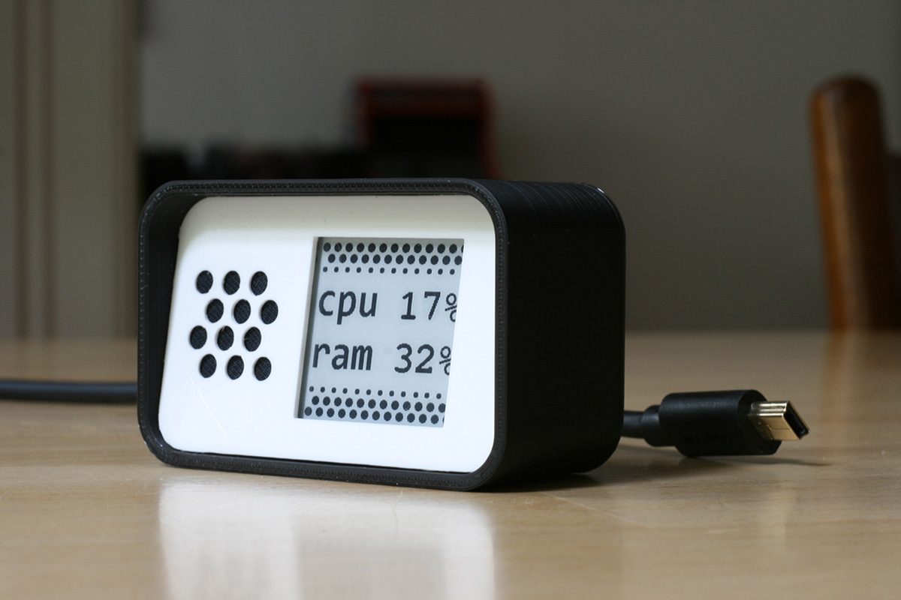

# CpuRamMonitor
Cpu and Ram usage monitor on an Arduino nano and a Waveshare 1.54" e-Paper display.

Designed and created by Alejandro Alvarez (Nomte), based on a sample code of the GxEPD Library
by Jean-Marc Zingg ( https://github.com/ZinggJM/GxEPD ). Also based on the code from
Arduino Forums "Serial Input Basics" by Robin2 ( https://forum.arduino.cc/index.php?topic=396450.0 ).

The device refresh the Cpu and Ram usage percentage every 2 seconds without flashing, and does a complete flashing refresh every 2 hours. That is healthy for the display.

Pinout to connect the display to the Arduino Nano board: Busy=D7, Reset=D8, DC=D9, CS=D10, CLK=D13, DIN=D11, GND=GND, VCC=3V3;

**IMPORTANT**: Change the COM port in the Python code (_default: COM5_) in order to match your own COM port number.

You can buy the components here:

Waveshare E-Ink display: https://www.banggood.com/1_54-Inch-E-ink-Screen-Display-e-Paper-Module-Support-Partial-Refresh-For-Arduino-Raspberry-Pi-p-1365280.html?rmmds=myorder&cur_warehouse=CN

Arduino nano compatible: https://es.banggood.com/ATmega328P-Nano-V3-Controller-Board-Compatible-Arduino-p-940937.html?rmmds=buy&cur_warehouse=CN

The files to 3Dprint the parts are also available here (BOX.stl and FRONT.stl) and the file units are **centimeters**. The final dimensions are 6.8 x 4.3 x 3.1 CMs.
